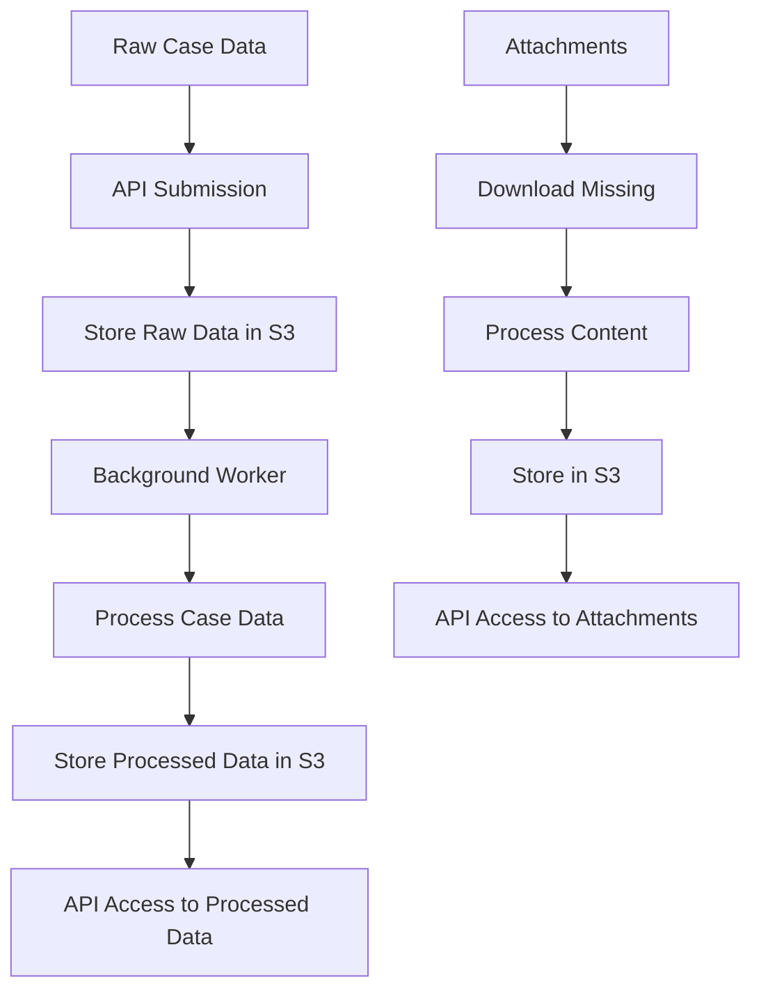

# Architecture Summary and Key Components

## Application Flow

## Key Modules and Responsibilities

### Main Module (src/main.rs)
- Application entry point
- Initializes tracing and OTel
- Sets up Axum server with routes
- Spawns background worker loop
- Configures CORS and middleware

### Server Module (src/server/)
- Defines all API routes
- Implements route handlers
- Handles request/response processing
- Integrates with Aide for documentation

### Types Module (src/types/)
- Defines all data structures
- Implements serialization/deserialization
- Defines processing traits
- Handles data validation

### Processing Module (src/processing/)
- Implements data transformation logic
- Handles background task processing
- Manages attachment processing
- Coordinates with LLM services

### S3 Integration (src/s3_stuff.rs)
- Manages all S3 operations
- Defines object storage paths
- Handles upload/download operations
- Implements caching mechanisms

### Case Worker (src/case_worker.rs)
- Implements background task processing
- Handles case processing without download
- Integrates with common task system

## Data Flow Details

### Case Submission Flow
1. Client submits RawCaseWithJurisdiction via POST /admin/cases/submit
2. Case is added to background task queue
3. ProcessCaseWithoutDownload task is executed
4. Raw case is stored in S3 (objects_raw/)
5. Case is processed into standardized format
6. Processed case is stored in S3 (objects/)
7. Processed case is available via GET /public/cases/{state}/{jurisdiction_name}/{case_name}

### Attachment Processing Flow
1. During case processing, attachments without hashes are identified
2. Attachments are downloaded and processed
3. Content is stored in S3 (raw/file/)
4. Metadata is stored in S3 (raw/metadata/)
5. Attachments are available via GET /public/raw_attachments/{blake2b_hash}/raw

### Reprocessing Flow
1. Client requests reprocessing via POST /admin/cases/reprocess_dockets_for_all
2. ReprocessDocketInfo tasks are created for each docket
3. Raw data is fetched from S3
4. Cached processed data is fetched from S3 (if exists)
5. Data is reprocessed with caching
6. Updated processed data is stored in S3

## Concurrency and Performance

### Parallel Processing
- Filings within a docket are processed concurrently (up to 5 at a time)
- Attachments within a filing are processed concurrently (up to 5 at a time)
- Multiple dockets can be processed in parallel
- Attachment downloads are limited (up to 2 at a time)

### Caching Strategy
- Processed data is cached in S3
- Cached data is reused when available
- Cache can be invalidated based on timestamps
- Hash-based caching for attachments

### Memory Management
- Streaming for large data processing
- Efficient data structures (HashMap for indexed access)
- Proper error handling to prevent memory leaks

## Error Handling

### Recoverable Errors
- Network failures (retried)
- S3 access issues (retried)
- Processing errors (logged and skipped)

### Non-Recoverable Errors
- Data validation failures
- Configuration errors
- Critical system failures

### Error Reporting
- Structured error responses
- Detailed logging with tracing
- Error metrics for monitoring

## Security Features

### Safe Mode
- PUBLIC_SAFE_MODE environment variable
- Disables admin routes when enabled
- Prevents unauthorized data modification

### Data Validation
- Strong typing with Serde
- Non-empty string validation
- Hash validation for attachments

### Access Control
- Read-only public endpoints
- Admin endpoints protected by safe mode
- CORS configuration for cross-origin requests

## Observability

### Tracing
- OpenTelemetry integration
- Request tracing
- Background task tracing
- Error tracing

### Logging
- Structured logging with tracing
- Context-aware log messages
- Error logging with details

### Monitoring
- Task queue monitoring
- Processing time metrics
- Error rate metrics

## Scalability Considerations

### Horizontal Scaling
- Stateless API service
- Shared S3 storage
- Distributed task queue

### Performance Optimization
- Concurrent processing
- Efficient data structures
- Caching strategies

### Resource Management
- Connection pooling for S3
- Memory-efficient processing
- Proper error handling to prevent resource leaks